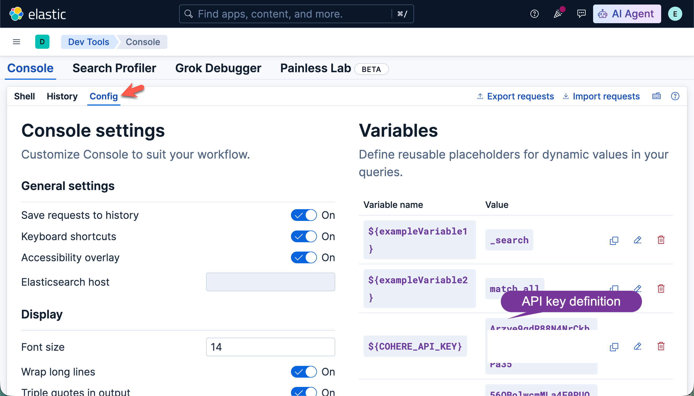
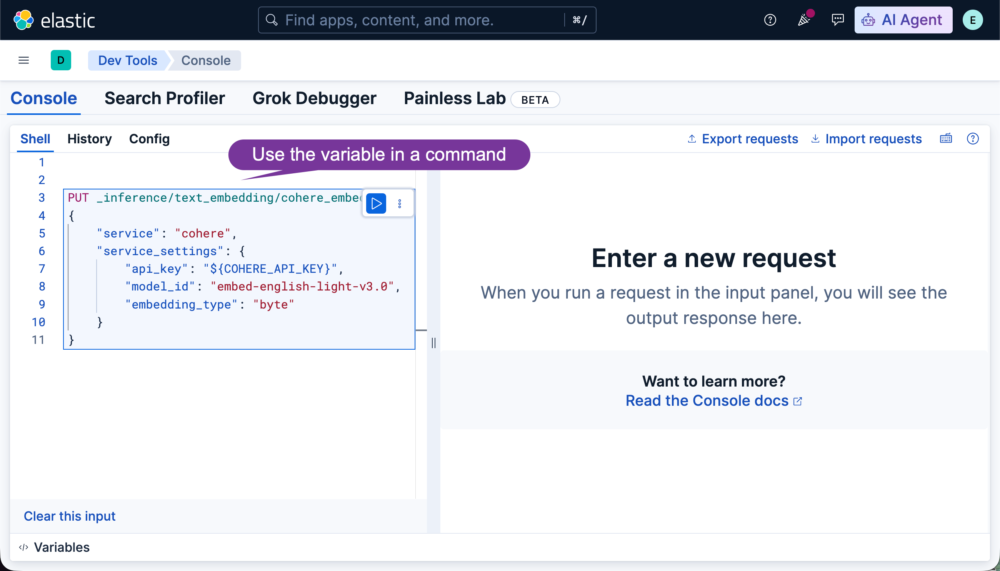

# Kibana DevTools Variables Manager

A pair of Python scripts to **back up** and **restore** Kibana DevTools Console variables.

Kibana stores DevTools variables in the browser's `localStorage` under the key `sense:variables` — not on the server — so these scripts use AppleScript to read/write directly from your running Chrome session.

## Files

| File | Description |
|---|---|
| `backup_devtools_variables.py` | Reads variables from Kibana and saves them to `devtools_variables.json` |
| `restore_devtools_variables.py` | Reads `devtools_variables.json` and writes the variables back to Kibana |
| `devtools_variables.json` | Saved variables (auto-generated by the backup script) |
| `.env` | Connection settings (not committed to version control) |

**Note:** It strongly suggested that you back up your variables first before restoring to any browsers

## Requirements

- macOS (AppleScript is used to communicate with Google Chrome)
- Python 3.11+
- Google Chrome with a Kibana tab open

Install dependencies:

```bash
pip install playwright python-dotenv
python -m playwright install chromium
```

## Configuration

Create a `.env` file in the project directory:

```env
KIBANA_URL=http://localhost:5601
KIBANA_API_KEY=<your-base64-encoded-api-key>
```

### Creating a Kibana API Key

In the Kibana UI go to **Stack Management → API Keys → Create API key**, or via the API:

```bash
curl -X POST "http://localhost:5601/api/security/api_key" \
  -H "kbn-xsrf: true" \
  -H "Content-Type: application/json" \
  -u elastic:<password> \
  -d '{"name": "devtools-variables-manager"}'
```

Use the `encoded` field from the response as `KIBANA_API_KEY`.

## Usage

### Backup variables

Reads `sense:variables` from your running Chrome and saves them to `devtools_variables.json`:

```bash
python backup_devtools_variables.py
```

### Restore variables

Writes the variables from `devtools_variables.json` back into Chrome's localStorage:

```bash
python restore_devtools_variables.py
```

After restoring, reload the Kibana DevTools Config page (`/app/dev_tools#/console/config`) to see the changes.

### Editing variables

`devtools_variables.json` is plain JSON — edit it freely between backup and restore:

```json
[
  { "name": "${COHERE_API_KEY}", "value": "Arzye9qdR88N4NrCkbv48aCxIUDVhqK611UTPa35" },
  { "name": "${OPENAI_API_KEY}", "value": "sk-..." }
]
```

Variable names must use the `${NAME}` format that Kibana displays in the Console.

## How it works

Both scripts try two strategies in order:

### Backup
| Strategy | Method | When it works |
|---|---|---|
| 1 | AppleScript into running Chrome | Chrome is open with a Kibana tab |
| 2 | Playwright with copied Chrome profile | Chrome is closed or AppleScript unavailable |
| 3 | Playwright fresh browser + API key | Fallback (returns server-default variables only) |

### Restore
| Strategy | Method | When it works |
|---|---|---|
| 1 | AppleScript into running Chrome | Chrome is open with a Kibana tab (recommended) |
| 2 | Playwright headless browser + API key | Fallback |

> **Why AppleScript?** Kibana variables live only in the browser's `localStorage`. A headless Playwright browser starts with empty storage and cannot see or modify your real browser's data. AppleScript injects JavaScript directly into the running Chrome process, bypassing this limitation.

## Notes

- The `.env` file contains sensitive API keys — add it to `.gitignore`
- The restore script generates a fresh UUID for each variable's `id` field, which is required by Kibana's internal format
- The backup script normalises variable names to the `${NAME}` format; the restore script strips the wrapper before writing back to localStorage




**License** ⚖️

This software is licensed under the [Apache License, version 2 ("ALv2")](https://github.com/elastic/elasticsearch-labs/blob/main/LICENSE).